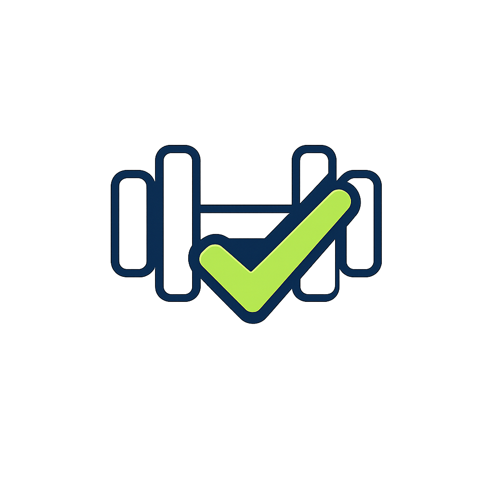

<br/>
<div align="center">
    
    <H1>Skulpt</H1>
</div>

Skulpt is a sleek and modern offline-first Android application designed to help you sculpt your ideal workout routine, track your fitness sessions, and visualize your progress with insightful statistics. Built natively for Android using Kotlin and Material 3 design principles, the application provides an uninterrupted, distraction-free environment engineered exclusively for your daily fitness goals.

## Core Features

*   **Customizable Workout Schedules**: Plan your weekly routine. Name your days, define target muscle groups, and list the exact exercises you want to perform.
*   **Intuitive Workout Editor**: Reorder exercises effortlessly with drag-and-drop, attach reference images from your gallery or via web search, and tailor rest timers for each sequence.
*   **Active Session Tracking**: Start a live workout session directly from your dashboard. Accurately log your sets, reps, and workout duration.
*   **Comprehensive Statistics**: Keep yourself accountable with the activity heatmap, streak tracking, workout consistency percentages, and muscle group distribution charts.
*   **Dynamic Theme Support**: Fully optimized for Dark and Light system themes with dynamic Material You coloring.
*   **Full Data Ownership**: Complete backup and restore functionality allows you to export your data (schedules, history, custom settings) to a `.bak` file locally. No cloud accounts required.

## Workout Data Format

Skulpt allows you to quickly import or share workout schedules via a simple JSON format. Below is an example of the acceptable schedule schema you can paste into the app:

```json
{
  "days": [
    {
      "colorHex": "#6750A4",
      "dayIndex": 0,
      "exercises": [
        {
          "name": "Pushups",
          "notes": "",
          "orderIndex": 0,
          "reps": 15,
          "sets": 3,
          "timerSeconds": 0
        },
        {
          "name": "Pullups",
          "notes": "",
          "orderIndex": 1,
          "reps": 8,
          "sets": 3,
          "timerSeconds": 0
        },
        {
          "name": "Squats",
          "notes": "",
          "orderIndex": 2,
          "reps": 12,
          "sets": 4,
          "timerSeconds": 0
        }
      ],
      "name": "My Workout"
    }
  ],
  "exportDate": "2026-03-18 10:31:53",
  "version": 1
}
```

## Development

*   **Technology Stack**: Android Native SDK, Kotlin, Room Database, Coroutines, Glide, MPAndroidChart.

### AI Contribution
Significant portions of Skulpt's underlying database infrastructure, complex dynamic logic (such as calendar heatmap scaling and Daylight Saving Time streak offsets), and user interface refinements were developed in tandem with Advanced Agentic AI. The AI acted as a pair-programmer to ensure clean architecture and robust performance.

## License

This project is licensed under the MIT License. You are free to use, modify, and distribute this software accordingly. Please see the [LICENSE](LICENSE) file for more information.
